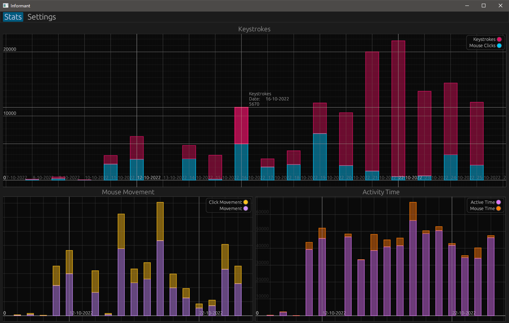

# Informant

A program to visual activity statistics produced by [Workrave](https://github.com/rcaelers/workrave).  
Written in Rust using [egui](https://github.com/emilk/egui).

---

## Install
### Pre-Built
1. Download the latest release binary [here](https://github.com/cmaybon/informant/releases/latest)
2. Run `informant.exe`
### Build
1. Run `cargo run --release`

---

### Changelog
See the changelog [here](CHANGELOG.md)